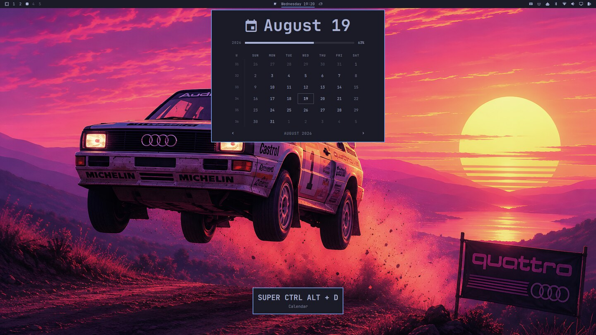
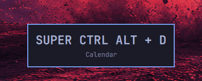
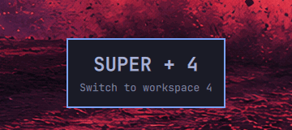
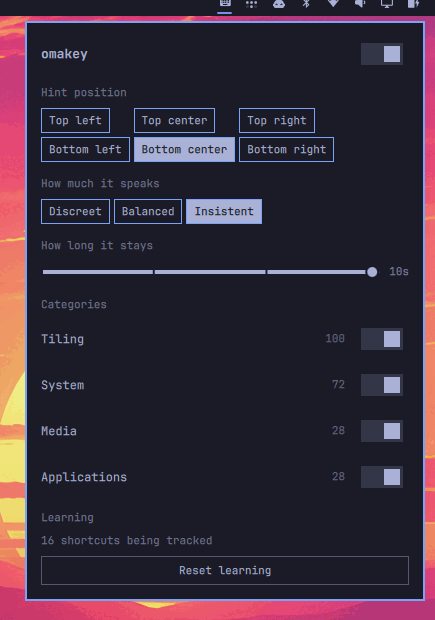

# omakey

**A Key Promoter for the [Omarchy](https://omarchy.org) desktop.** When you do
something with the mouse that a keybinding already does, omakey tells you the
key you could have pressed — and then gets out of the way, on a schedule that
spaces itself out as you learn.



It reads the keybindings **you** have configured, not a hardcoded list, so your
own overrides in `~/.config/hypr/bindings.lua` are promoted the same as
Omarchy's defaults.

| | |
| --- | --- |
| Requires | Omarchy 4 (Hyprland 0.56+, `omarchy-shell`) |
| Kinds | `service`, `panel`, `bar-widget` |
| Touches your config | Nothing persistent. Everything is injected at runtime |
| State | One file: `~/.local/state/omakey/stats.json` |

## Why it is worth having

Everybody who runs a tiling desktop already has 200-odd shortcuts configured.
Almost nobody uses more than a dozen. The gap is not motivation — it is that a
shortcut you have never pressed is invisible exactly when you need it, and a
cheat sheet is something you read once, in the wrong context, and forget.

omakey closes the gap by inverting the moment. It says nothing until you take
the slow path, and then it names the fast one, while your hand is still on the
mouse and the intent is still in your head. That is the one instant where the
information is worth anything.

- **No list to read.** The prompt arrives at the moment of use, not in a manual.
- **It stops on its own.** Once you start pressing the key, the reminder for it
  moves further and further out and then effectively disappears. See
  [How hints space out](#how-hints-space-out).
- **It admits when it is wrong.** A hint you ignore repeatedly is a hint omakey
  retires by itself, rather than a plugin you retire.
- **It teaches your config, not a generic one.** The bindings it promotes are
  scanned from your Lua config, with your descriptions and your overrides.

## What a hint looks like

Two real hints, captured on a stock Omarchy install.

Clicking the clock in the bar, when a key already opens that calendar:



Switching workspaces from the bar instead of pressing the workspace key:



The card carries the key combination and the binding's own description — the
same description `omarchy menu keybindings` shows, because it comes from the
same place. It sits wherever you put it (six positions), fades after a dwell
time you choose, and takes two clicks:

- **Left-click** dismisses it.
- **Right-click** mutes that action for good.


## The preferences panel

omakey puts one button on the bar (`󰌌`). Clicking it opens everything there is
to configure — a master switch, where hints appear, how long they stay, how much
omakey speaks, which categories it speaks about, and how to make it forget.



The icon dims while any category is muted, so a silenced omakey never looks like
a broken one.

## Install

```bash
omarchy plugin add https://github.com/edumoraes/omakey.git --enable
```

Run it without `--yes`. Omarchy asks which bar section the omakey button should
go in, and that prompt is skipped for a non-interactive install. To place it
later, or to move it:

```bash
omarchy plugin enable omakey --section right --before omarchy.tray
omarchy bar move omakey --section left
```

**Upgrading from 0.1.x.** omakey used to be a service and panel only, so its
shell.json entry sits in `plugins[]` rather than in the bar layout. Omarchy adds
a widget to the bar only when the plugin has no entry at all, so enabling it on
top of the old one does nothing — and reports `Enabled and moved omakey` while
doing it. Disable first:

```bash
omarchy plugin disable omakey
omarchy plugin enable omakey --section right
```

## Uninstall

```bash
omarchy plugin remove omakey
hyprctl reload
```

The `hyprctl reload` is what removes the bindings omakey registered. It is also
the general escape hatch: omakey writes nothing to your Hyprland configuration,
so reloading always returns Hyprland to exactly what your own config says.

## How it works

Omarchy 4 configures Hyprland in Lua, and Hyprland runs *every* binding
registered on a key combination — not just the first. omakey uses that: at
startup it reads your config, then registers one extra, invisible binding beside
each of yours, whose only job is to emit a custom event on Hyprland's IPC
socket.

That means the "you pressed a key" signal and the "something changed" signal
arrive on the **same ordered stream**. When a window closes or a workspace
changes with no keypress beside it, the mouse did it — and omakey can say which
key would have been faster.

```
you press SUPER+4   -> shadow binding fires -> workspace changes -> silence
you click the bar   ->      (no shadow)     -> workspace changes -> hint
```

Those companion bindings carry no description, so they stay out of
`omarchy menu keybindings` entirely. They are also the reason `hyprctl binds`
roughly doubles while omakey runs — 228 becomes 456 on a default install:

```bash
hyprctl binds | grep -c '^bind'          # doubled
hyprctl binds | grep -c 'omakey'         # 0 - they are anonymous
omarchy menu keybindings --print | wc -l # unchanged
```

Some actions are harder than a workspace switch, and omakey handles them by
being conservative:

- **Closing a window** is far more often the app's own Ctrl+W than a click on a
  titlebar button, so a close is only promoted when the cursor actually moved
  just before it, over the window that closed.
- **Menus and bar panels all share one layer surface**, so the compositor event
  says "a menu opened" and not which one. omakey asks the shell, at the instant
  the surface appears, which panel it has open and which menu the menu plugin is
  showing — and stays silent when the answer is ambiguous.

## How hints space out

omakey schedules each shortcut the way Anki schedules a card, on **SM-2** —
minus the cards, and minus being asked anything. You never grade yourself: the
grade is which input device you reached for.

- Use the **keyboard**, and that shortcut is a review you passed. Its next
  reminder moves further out: one interval, then six of them, then multiplied by
  an ease factor that itself creeps up with each success. A shortcut you have
  been getting right for a week is effectively silent.
- Use the **mouse** after the reminder has come due, and that is a lapse. You get
  the hint, the shortcut drops back to the first interval, and its ease takes the
  SM-2 penalty — so a shortcut that keeps slipping is offered more often than one
  that stuck the first time.
- Use the mouse **before** it is due and omakey says nothing. It already told you
  recently enough.

The ease starts at 2.5, is floored at 1.3, gains 0.1 per success and loses 0.32
per lapse, and no interval grows past 30 days. Each shortcut carries its own
schedule, so the ones you have learned go quiet while the ones you have not keep
their reminders.

On top of the schedule sit two guards that stop a hint from ever becoming a nag:

- **A quiet start.** The first few times you do something with the mouse, omakey
  watches and says nothing. Not every mouse action is a habit worth correcting.
- **Self-demotion.** A hint shown several times that you never adopt is either
  mapped to the wrong binding or unwanted. Either way omakey stops showing it,
  permanently, without being asked.

### Intensity

One setting instead of three counters, because in practice they move together.

| | Silent for the first | First interval | Gives up after |
| --- | --- | --- | --- |
| `discreet` | 6 uses | 5 minutes | 3 ignored hints |
| `balanced` | 3 uses | 1 minute | 5 ignored hints |
| `insistent` | 1 use | 15 seconds | 10 ignored hints |

The first interval is the first step of the schedule, so the intensity sets how
far the whole ladder reaches — every later interval is built out of it.

## What it learns

Some pairings cannot be read out of a config file, so omakey learns them from
you. Whenever a keypress and its effect arrive together, that is a labelled
example: this key produces this effect. Nothing about the pairing needs guessing
after that.

- **Which app a launcher opens.** Nothing in the string
  `omarchy-launch-terminal` says which window class appears. Press the key once
  and omakey knows; open the same app with the mouse afterwards and it names the
  key.
- **Which panel a command raises.** `omarchy-menu toggle reminder-set` opens the
  reminders panel, and `omarchy-agent --pick` opens the agents picker. No seed
  can pair those, and one keypress does.

Everything else is derived from the config directly — workspace switches,
window close, fullscreen, floating, scratchpad and every panel whose command
names it — so omakey is useful before it has learned anything at all.

What it learns is kept separately from your progress, and the reset button keeps
it: forgetting the schedule restarts *you*, not the plugin's accuracy.

## Settings

Everything is stored as inline fields on omakey's entry in
`~/.config/omarchy/shell.json`, so it can also be edited by hand. The entry is in
`bar.layout` when the button is on the bar and in `plugins[]` otherwise:

```json
{ "id": "omakey", "toastPosition": "bottom-right", "intensity": "discreet" }
```

| Key | Default | What it does |
| --- | --- | --- |
| `hintsEnabled` | `true` | The master switch. Turn it off and omakey stays silent without forgetting anything it has learned. |
| `toastPosition` | `bottom-center` | Which corner or edge the hint appears at: `top-left`, `top-center`, `top-right`, `bottom-left`, `bottom-center`, `bottom-right`. |
| `intensity` | `balanced` | How readily omakey speaks. See above. |
| `toastDuration` | `4000` | How long the hint stays up, in milliseconds. Four stops: `2000`, `4000`, `7000`, `10000`. |
| `mutedCategories` | `[]` | Categories omakey stays quiet about. |
| `resetAt` | absent | Set by the panel's reset button. A timestamp newer than the one omakey has already acted on clears everything it has learned. |
| `cursorIdleMs` | `800` | How recently the cursor must have moved for a window close to count as a mouse action. |
| `record` | `false` | Development aid: writes every IPC event to `~/.local/state/omakey/stream.jsonl`. |

Turning omakey off leaves its counters untouched, so switching it back on
resumes where it left off rather than starting over. The same is true of an
individual category.

### Categories

omakey groups your keybindings by the file that declares them, so the list
reflects your actual configuration rather than a fixed table. On a stock Omarchy
install that is:

| Category | Bindings |
| --- | --- |
| Tiling | 100 |
| System | 72 |
| Media | 28 |
| Applications | 28 |

Tiling covers more than windows: `tiling.lua` declares every workspace and
monitor binding too. A bindings file omakey does not recognise becomes a
category of its own rather than going missing.

Turning a category off silences its hints without affecting anything else — and
without spending its counters, so turning it back on starts from where it left
off.

### Resetting

The bottom of the panel says how many shortcuts omakey is currently scheduling
and offers a **Reset learning** button, which takes two clicks. It throws away
every interval and every counter, so all your shortcuts start over at the
beginning. What it keeps is omakey's own calibration — which desktop event
belongs to which binding — because that is the plugin's accuracy, not your
progress.

## What it cannot see

Some things stay silent, and it is not a fault:

- **Menu entries.** Picking *Screenshot* out of the Omarchy menu with the mouse
  is not promoted. Catching it needs a signal from the shell when it runs a
  command, and QML refuses to let a plugin wrap `Util.execDetached` — singleton
  methods are read-only properties, and `Object.defineProperty` does not reach a
  QObject's meta-object. Clicking a workspace in the bar *is* promoted, because
  that produces a real workspace change on the IPC stream.
- **The OSD and notifications.** The OSD rises on a volume change no key caused
  and a notification arrives on its own, so there is no key to name.
- **Panels no key opens.** Clicking the tailscale or weather widget opens a panel
  that no binding in the config reaches. The log says which panel it was and that
  nothing is bound to it.
- **Toggles that change no surface.** Night light, idle locking and notification
  silencing emit nothing on the compositor's event stream — there is no effect to
  notice.
- **Window focus by mouse.** Deliberately out of scope: with focus-follows-mouse
  it is a constant source of false positives and teaches nothing.

A suggestion asking Omarchy for a "command executed" signal — the one hook that
would bring menu entries and those toggles into reach — is drafted at
[`docs/upstream/2026-08-19-command-executed-signal.md`](docs/upstream/2026-08-19-command-executed-signal.md).

## What it touches

- **Nothing persistent in your configuration.** No edits to `~/.config/hypr/`, no
  shell profile hooks, no `PATH` changes. Its bindings are injected at runtime
  and disappear on reload.
- **One state file**, `~/.local/state/omakey/stats.json`, holding what omakey has
  learned, the schedule that spaces each shortcut's hints out, and the category
  list the settings panel reads. Delete it to start over — or use the panel's
  reset button, which is the same thing without leaving the desktop.
- **Your preferences**, on omakey's own entry in `~/.config/omarchy/shell.json`.
  That file is Omarchy's, and omakey only ever writes its own entry, through the
  shell's own API.
- **Nothing leaves your machine.** No network, no telemetry. omakey reads
  Hyprland's IPC socket and your own config, and that is all.

### How your config is read

There is no way to recover a binding's meaning from `hyprctl binds` — under the
Lua config provider every one of them reports as `dispatcher: __lua`. So omakey
does what Omarchy's own `omarchy-menu-keybindings` does: it **executes** your
config in a short-lived `lua` process of its own, with `hl` replaced by a proxy,
and records every `hl.bind` call instead of performing it. Nothing reaches the
compositor.

Your config is your own code and Hyprland already runs it. What is new is that
omakey runs it a *second* time, on startup and on every config reload — so a
side effect you wrote to happen once starts happening on omakey's schedule
instead of yours. That is the part omakey is responsible for, and it is
contained: the config runs against an environment built for the scan, not the
real one.

| | |
| --- | --- |
| Commands | `os.execute` never runs one. It reports the command as having failed |
| Writes | `io.open` in a write mode, `os.remove`, `os.rename`, `os.tmpname` and `io.output` are refused |
| Modules | `require` and `dofile` read Lua source through the scan's own loader; `package.cpath` is empty, so no compiled module is loaded |
| Runtime code | `load` and `loadfile` compile text only and force the same environment — stock Lua would hand back the real one, and a *binary* chunk would ignore any environment at all, so those are refused outright |
| Output | `print` and `io.stdout` go to a sink, so a stray print cannot pose as a binding |

Reading is deliberately untouched: Omarchy's own `require_all.lua` enumerates
its bindings directories before a single binding is declared, and a scanner that
cannot read finds nothing at all. That enumeration is the one command a scan
runs, and it does not run your config's version of it — the `find` is recognised
by shape, the directory is taken out of it, and the command is rebuilt from
omakey's own text, so your config contributes a directory name inside a quoted
argument and never a command.

None of this costs coverage. On a stock Omarchy install the sandboxed and
unsandboxed scans produce byte-identical output — all 228 bindings — because the
only thing that shells out at load is the nvidia driver probe, which decides
driver settings rather than bindings.

The scan also happens in a separate process, so none of it runs inside your
shell.

## Reporting a problem

omakey logs one line at startup saying what is actually live. Paste it into any
bug report:

```bash
journalctl --user -t omarchy-shell | grep 'omakey: capabilities'
```

```
omakey: capabilities {"registry":true,"shadows":true,"commands":false,"owners":true} tiers {"effects":true,"commands":false}
```

- `registry` — omakey could read your keybindings.
- `shadows` — the invisible companion bindings are live in Hyprland.
- `commands` — always `false`; see *What it cannot see* above.
- `owners` — the shell can be asked who opened a shared panel surface.

If `shadows` is false, omakey goes completely silent rather than guessing:
without them there is no way to tell a keypress from a click, so every action
would look like a mouse action. Silence is the intended failure mode.

Every decision omakey makes is logged, including the silent ones, so a hint that
did not appear can be explained:

```bash
journalctl --user -t omarchy-shell -f | grep omakey
```

```
omakey: registry loaded 228 bindings
omakey: shadow bindings injected 228
omakey: silent workspace:4 quiet-start
omakey: hint layer:omarchy.clock SUPER CTRL ALT + D
omakey: learned openlayer -> 132
```

## Development

All the logic lives in plain `.js` models beside the QML, so it is testable with
no desktop involved.

```bash
git clone https://github.com/edumoraes/omakey.git
cd omakey
node --test                   # 164 unit tests

ln -sfn "$PWD" ~/.config/omarchy/plugins/omakey
omarchy plugin validate .
omarchy restart shell         # QML changes need a real restart
```

See [CLAUDE.md](CLAUDE.md) for the architecture, the platform facts each design
decision rests on, and the rules a contributor must not break. The design spec
and the implementation plan are under [`docs/`](docs/).

## License

MIT. See [LICENSE](LICENSE).
